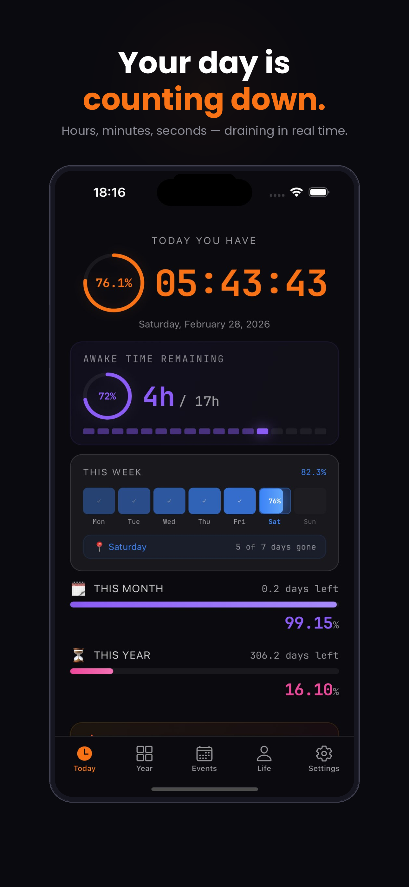

# Finite Landing Page -- Design Specification

> Developer-ready visual system and implementation guide.
> Last updated: 2026-03-13
> Designer: UI Designer Agent
> Status: Ready for frontend implementation

---

## Table of Contents

1. [Design Foundations](#1-design-foundations)
2. [Page Structure & Section Order](#2-page-structure--section-order)
3. [CSS Architecture & Custom Properties](#3-css-architecture--custom-properties)
4. [Component Specifications](#4-component-specifications)
5. [Visual Effects & Animations](#5-visual-effects--animations)
6. [Responsive Breakpoints](#6-responsive-breakpoints)
7. [Micro-interactions](#7-micro-interactions)
8. [Accessibility Requirements](#8-accessibility-requirements)
9. [Asset Manifest](#9-asset-manifest)
10. [Implementation Notes](#10-implementation-notes)

---

## 1. Design Foundations

### 1.1 Brand Personality

Finite is a premium time awareness app. The landing page must feel like a luxury watch brand
website that was designed by someone who also builds developer tools. Every element should
convey precision, intentionality, and quiet urgency. The page should make visitors feel the
weight of passing time before they even read a word.

**Key adjectives:** Minimalist. Moody. Premium. Precise. Contemplative.

### 1.2 Color System

```
PALETTE TOKEN                 HEX / VALUE                    USAGE
----------------------------------------------------------------------
--color-bg                    #0A0A0F                        Page background
--color-bg-elevated           #0E0E14                        Elevated surfaces (cards, modals)
--color-bg-hover              #121218                        Card hover background
--color-surface               rgba(255, 255, 255, 0.03)     Glass card fill
--color-surface-hover         rgba(255, 255, 255, 0.05)     Glass card hover fill
--color-border                rgba(255, 255, 255, 0.06)     Default borders
--color-border-hover          rgba(255, 255, 255, 0.10)     Hover state borders
--color-border-active         rgba(249, 115, 22, 0.40)      Active/featured borders

--color-text-100              #FFFFFF                        Headlines, primary text
--color-text-90               rgba(255, 255, 255, 0.90)     Strong body text
--color-text-80               rgba(255, 255, 255, 0.80)     Emphasis text
--color-text-72               rgba(255, 255, 255, 0.72)     Standard body text
--color-text-65               rgba(255, 255, 255, 0.65)     Descriptions
--color-text-58               rgba(255, 255, 255, 0.58)     Secondary text
--color-text-50               rgba(255, 255, 255, 0.50)     Muted / captions
--color-text-20               rgba(255, 255, 255, 0.20)     Dim labels, ghost text
--color-text-10               rgba(255, 255, 255, 0.10)     Barely visible (bar labels)
--color-text-08               rgba(255, 255, 255, 0.08)     Copyright, ultra-subtle

--color-orange                #F97316                        Primary accent
--color-orange-dark           #EA580C                        Orange hover / gradient end
--color-orange-glow           rgba(249, 115, 22, 0.15)      Button glow, subtle radials
--color-orange-border         rgba(249, 115, 22, 0.20)      Orange-tinted borders
--color-orange-surface        rgba(249, 115, 22, 0.05)      Orange-tinted backgrounds
--color-orange-surface-hover  rgba(249, 115, 22, 0.08)      Orange surface hover

--color-blue                  #3B82F6                        Secondary accent (year tab, links)
--color-green                 #22C55E                        Success, savings badges, life phases
--color-purple                #8B5CF6                        Life map phases, premium indicator
--color-pink                  #EC4899                        Life map phases, emphasis
--color-red                   #EF4444                        Urgency, progress bar gradient end
--color-yellow                #EAB308                        Life map childhood phase

--color-selection             rgba(249, 115, 22, 0.30)      Text selection highlight
```

#### Color Usage Rules

1. **Never use pure white (#FFFFFF) for body text.** Reserve it for headlines only.
2. **Orange is the only warm color on the page.** It draws the eye to CTAs and key data.
3. **Glass surfaces** use `rgba(255,255,255,0.03)` fill with `rgba(255,255,255,0.06)` border.
4. **Featured/active states** shift border to orange-tinted: `rgba(249,115,22,0.40)`.
5. **Gradients** always flow from `--color-orange` to `--color-orange-dark` at 135 degrees.
6. **Glow effects** use `box-shadow` with orange at low opacity (0.15 resting, 0.25 hover).

### 1.3 Typography System

```
FONT FAMILY                   WEIGHT RANGE      USAGE
----------------------------------------------------------------------
"Outfit", system-ui, sans-serif   300-800       All UI text, headlines, body
"JetBrains Mono", monospace       400-700       Numbers, labels, code-like text, badges
```

#### Type Scale

```
TOKEN                SIZE        LINE HEIGHT   WEIGHT    FONT FAMILY      USAGE
------------------------------------------------------------------------------------
--text-hero-number   clamp(64px, 12vw, 110px)  1.0   800   Outfit       Hero countdown number
--text-display       clamp(36px, 6vw, 60px)    1.1   800   Outfit       Hero headline
--text-h2            clamp(26px, 4.5vw, 38px)  1.2   700   Outfit       Section titles
--text-h3            20px                       1.3   700   Outfit       Card headlines
--text-h4            16px                       1.3   700   Outfit       Feature card titles
--text-body-lg       17px                       1.6   400   Outfit       Hero subtitle
--text-body          16px                       1.6   400   Outfit       Section descriptions
--text-body-sm       14px                       1.7   400   Outfit       Legal body text, nav links
--text-caption        13px                      1.5   400   Outfit       Feature card body, footer links

--text-mono-lg       15px                       1.4   400   JetBrains    Hero number label
--text-mono          12px                       1.4   500   JetBrains    Section labels, timestamps
--text-mono-sm       11px                       1.8   400   JetBrains    Pricing details, screenshot labels
--text-mono-xs       10px                       1.4   600   JetBrains    Badges (trial, save)
--text-mono-xxs       9px                       1.4   700   JetBrains    Pricing badge ("MOST POPULAR")
```

#### Typography Rules

1. **Letter spacing:** Headlines use -2px to -4px. Section labels use +3px with uppercase.
2. **JetBrains Mono** is used exclusively for data-like text: numbers, percentages, labels,
   badges, timestamps, and anything that looks like it belongs on a dashboard.
3. **Outfit** handles everything else: headlines, body copy, nav links, button text.
4. **All sizes use `clamp()`** where possible for fluid scaling between breakpoints.
5. **Antialiasing:** `-webkit-font-smoothing: antialiased` on body. Critical for dark themes.

### 1.4 Spacing System

Base unit: 4px. All spacing values are multiples of this base.

```
TOKEN           VALUE     PX EQUIV    USAGE
----------------------------------------------
--space-1       0.25rem    4px        Tight internal gaps
--space-2       0.5rem     8px        Icon-to-text gaps
--space-3       0.75rem   12px        Card internal padding (compact)
--space-4       1rem      16px        Standard padding, nav links gap
--space-5       1.25rem   20px        Card padding horizontal
--space-6       1.5rem    24px        Section horizontal padding, nav link gaps
--space-8       2rem      32px        Between section title and description
--space-10      2.5rem    40px        Hero CTA horizontal padding
--space-12      3rem      48px        Section description to content gap
--space-14      3.5rem    56px        Between major content blocks
--space-16      4rem      64px        Footer top padding
--space-20      5rem      80px        Hero bottom padding, legal section padding
--space-22      5.5rem    88px        Section vertical padding
--space-24      6rem      96px        Between full sections
--space-30      7.5rem   120px        Hero top padding (accounts for nav)
```

#### Section Rhythm

The page uses a **90px vertical padding** per section. The hero is full-viewport. The quote
section uses 80px padding. Legal sections use 80px padding. This creates a consistent
breathing room between major content blocks.

```
Section gap (between major sections):   90px top + 90px bottom = content breathes
Hero:                                   120px top (nav clearance) + 80px bottom
Quote section:                          80px top + 80px bottom
Legal sections:                         80px top + 80px bottom
Footer:                                 40px top + 60px bottom
```

### 1.5 Elevation & Shadow System

```
TOKEN                    VALUE                                    USAGE
--------------------------------------------------------------------------
--shadow-none            none                                     Default flat state
--shadow-card            0 20px 60px rgba(0, 0, 0, 0.40)         Screenshot cards
--shadow-button          0 0 30px rgba(249, 115, 22, 0.15)       CTA buttons resting
--shadow-button-hover    0 0 50px rgba(249, 115, 22, 0.25)       CTA buttons hover
--shadow-glow-sm         0 0 20px rgba(249, 115, 22, 0.10)       Subtle glows
--shadow-glow-lg         0 0 80px rgba(249, 115, 22, 0.08)       Hero radial glow
```

### 1.6 Border Radius System

```
TOKEN                VALUE      USAGE
----------------------------------------
--radius-sm          6px        Badges, small tags
--radius-md          8px        Nav CTA button, small inputs
--radius-lg         14px        Hero CTA button
--radius-xl         16px        Feature cards, pricing cards
--radius-2xl        20px        Hero label pill
--radius-3xl        24px        Screenshot items (phone mockup frames)
--radius-full       9999px      Progress bars, circular elements
```

---

## 2. Page Structure & Section Order

### 2.1 Complete Section Map (Top to Bottom)

```
SECTION #   NAME                  LAYOUT TYPE         BG TREATMENT
------------------------------------------------------------------------
  0         Navigation            Fixed, full-width   Glassmorphism
  1         Hero                  Full viewport       Radial glow + particle field
  2         Screenshots           Full-width scroll   None (inherits page bg)
  3         Quote                 Full-width, center  Border-top + border-bottom
  4         Features              Contained, grid     None (inherits page bg)
  5         Pricing               Contained, grid     None (inherits page bg)
  6         Final CTA             Full-width, center  Gradient glow background
  7         Social Proof          Contained, grid     None (inherits page bg)
  8         Terms of Service      Contained, text     Divider line above
  9         Privacy Policy        Contained, text     Divider line above
  10        Footer                Full-width, center  Border-top
```

### 2.2 Detailed Section Layout

Each section below defines its container width, alignment, and internal structure.

#### Section 0: Navigation
- **Position:** `fixed`, top: 0, left: 0, right: 0
- **Z-index:** 100
- **Height:** 52px (14px padding top + bottom + content)
- **Max-width:** Full viewport width (no max-width constraint)
- **Background:** `rgba(10, 10, 15, 0.85)` with `backdrop-filter: blur(20px)`
- **Border:** 1px solid `var(--color-border)` on bottom
- **Layout:** Flexbox, space-between, vertically centered
- **Left:** Logo text "Finite" (orange, 800 weight)
- **Right:** Horizontal link group + CTA button

#### Section 1: Hero
- **Height:** `min-height: 100vh`
- **Layout:** Flexbox column, centered both axes
- **Max-width:** None (full viewport), content constrained by individual max-widths
- **Padding:** 120px top, 80px bottom, 24px horizontal
- **Background element:** Radial glow (900x900px circle, positioned top-center)
- **Content stack (top to bottom):**
  1. Pill label ("TIME AWARENESS APP") -- max-width auto
  2. Hero number ("16,060") -- clamp sizing
  3. Number label ("days left in your life") -- max-width auto
  4. Progress bar (180px wide, 4px tall)
  5. Bar label ("41.5% gone")
  6. Headline h1 -- max-width 650px
  7. Subtitle paragraph -- max-width 460px
  8. CTA button
  9. Store notice text

#### Section 2: Screenshots
- **Wrapper:** Full-width, overflow hidden, padding 60px vertical
- **Inner scroll container:** Horizontal flex, max-width 960px, margin auto
- **Scroll behavior:** `scroll-snap-type: x mandatory`, hidden scrollbar
- **Items:** 5 screenshot cards, each 200px wide, flex-shrink 0
- **Gap:** 20px between items
- **Horizontal padding:** 24px (allows peek of offscreen items on mobile)

#### Section 3: Quote
- **Layout:** Full-width, text center
- **Padding:** 80px vertical, 24px horizontal
- **Borders:** 1px solid `var(--color-border)` on top AND bottom
- **Content:** Single `<p>` element, max-width 600px, centered
- **Typography:** clamp(22px, 4vw, 32px), weight 300, muted color
- **Highlight:** `<strong>` tag in orange, weight 700

#### Section 4: Features
- **Container:** max-width 960px, margin auto
- **Padding:** 90px vertical, 24px horizontal
- **Header stack:**
  1. Section label (JetBrains Mono, orange, uppercase, letterspaced)
  2. Section title (clamp h2)
  3. Section description (muted, max-width 520px)
- **Grid:** 3 columns, 14px gap
- **Cards:** 6 feature cards (2 rows x 3 columns)

#### Section 5: Pricing
- **Container:** max-width 960px, margin auto
- **Padding:** 90px vertical, 24px horizontal
- **Header stack:** Same pattern as Features
- **Grid:** 4 columns, 14px gap
- **Cards:** Free, Yearly (featured), Monthly, Lifetime

#### Section 6: Final CTA (NEW -- not in current build)
- **Layout:** Full-width, text center
- **Padding:** 100px vertical, 24px horizontal
- **Background:** Subtle radial gradient glow from center (orange at 0.04 opacity)
- **Content stack:**
  1. Large headline: "Your time is already counting."
  2. Subtitle paragraph
  3. CTA button (same style as hero)
  4. Store notice text
- **Purpose:** Re-engage visitors who scrolled past pricing without converting

#### Section 7: Social Proof / Testimonials (NEW -- not in current build)
- **Container:** max-width 960px, margin auto
- **Padding:** 90px vertical, 24px horizontal
- **Layout:** 3-column grid, 14px gap
- **Cards:** Minimal testimonial cards with quotation marks
- **Content per card:**
  1. Large open-quote mark (orange, 32px)
  2. Quote text (body-sm, muted)
  3. Attribution (mono-sm, dim)

#### Section 8: Terms of Service
- **Container:** max-width 760px, margin auto
- **Padding:** 80px vertical, 24px horizontal
- **Divider:** Full-width 1px line above (max-width 760px)
- **Typography:** Legal body style (14px, 1.7 line-height, muted)

#### Section 9: Privacy Policy
- **Container:** Same as Terms
- **Divider:** Same as Terms

#### Section 10: Footer
- **Layout:** Full-width, text center
- **Padding:** 40px top, 60px bottom, 24px horizontal
- **Border:** 1px solid `var(--color-border)` on top
- **Content stack:**
  1. Logo text "Finite" (orange, 800 weight, 18px)
  2. Horizontal link row (flex, centered, wrapped)
  3. Copyright text (mono, ultra-dim)

---

## 3. CSS Architecture & Custom Properties

### 3.1 Complete Custom Properties Block

```css
:root {
  /* ===== COLORS ===== */
  --color-bg: #0A0A0F;
  --color-bg-elevated: #0E0E14;
  --color-bg-hover: #121218;
  --color-surface: rgba(255, 255, 255, 0.03);
  --color-surface-hover: rgba(255, 255, 255, 0.05);
  --color-border: rgba(255, 255, 255, 0.06);
  --color-border-hover: rgba(255, 255, 255, 0.10);
  --color-border-active: rgba(249, 115, 22, 0.40);

  --color-text-100: #FFFFFF;
  --color-text-90: rgba(255, 255, 255, 0.90);
  --color-text-80: rgba(255, 255, 255, 0.80);
  --color-text-72: rgba(255, 255, 255, 0.72);
  --color-text-65: rgba(255, 255, 255, 0.65);
  --color-text-58: rgba(255, 255, 255, 0.58);
  --color-text-50: rgba(255, 255, 255, 0.50);
  --color-text-20: rgba(255, 255, 255, 0.20);
  --color-text-10: rgba(255, 255, 255, 0.10);
  --color-text-08: rgba(255, 255, 255, 0.08);

  --color-orange: #F97316;
  --color-orange-dark: #EA580C;
  --color-orange-glow: rgba(249, 115, 22, 0.15);
  --color-orange-border: rgba(249, 115, 22, 0.20);
  --color-orange-surface: rgba(249, 115, 22, 0.05);
  --color-orange-surface-hover: rgba(249, 115, 22, 0.08);

  --color-blue: #3B82F6;
  --color-green: #22C55E;
  --color-purple: #8B5CF6;
  --color-pink: #EC4899;
  --color-red: #EF4444;
  --color-yellow: #EAB308;

  --color-selection: rgba(249, 115, 22, 0.30);

  /* ===== TYPOGRAPHY ===== */
  --font-primary: 'Outfit', system-ui, -apple-system, sans-serif;
  --font-mono: 'JetBrains Mono', 'SF Mono', 'Fira Code', monospace;

  --text-hero-number: clamp(64px, 12vw, 110px);
  --text-display: clamp(36px, 6vw, 60px);
  --text-h2: clamp(26px, 4.5vw, 38px);
  --text-h3: 20px;
  --text-h4: 16px;
  --text-body-lg: 17px;
  --text-body: 16px;
  --text-body-sm: 14px;
  --text-caption: 13px;

  --text-mono-lg: 15px;
  --text-mono: 12px;
  --text-mono-sm: 11px;
  --text-mono-xs: 10px;
  --text-mono-xxs: 9px;

  /* ===== SPACING ===== */
  --space-1: 0.25rem;
  --space-2: 0.5rem;
  --space-3: 0.75rem;
  --space-4: 1rem;
  --space-5: 1.25rem;
  --space-6: 1.5rem;
  --space-8: 2rem;
  --space-10: 2.5rem;
  --space-12: 3rem;
  --space-14: 3.5rem;
  --space-16: 4rem;
  --space-20: 5rem;
  --space-22: 5.5rem;
  --space-24: 6rem;
  --space-30: 7.5rem;

  /* ===== BORDERS ===== */
  --radius-sm: 6px;
  --radius-md: 8px;
  --radius-lg: 14px;
  --radius-xl: 16px;
  --radius-2xl: 20px;
  --radius-3xl: 24px;
  --radius-full: 9999px;

  /* ===== SHADOWS ===== */
  --shadow-card: 0 20px 60px rgba(0, 0, 0, 0.40);
  --shadow-button: 0 0 30px rgba(249, 115, 22, 0.15);
  --shadow-button-hover: 0 0 50px rgba(249, 115, 22, 0.25);
  --shadow-glow-sm: 0 0 20px rgba(249, 115, 22, 0.10);
  --shadow-glow-lg: 0 0 80px rgba(249, 115, 22, 0.08);

  /* ===== TRANSITIONS ===== */
  --ease-out: cubic-bezier(0.25, 0.46, 0.45, 0.94);
  --ease-out-back: cubic-bezier(0.34, 1.56, 0.64, 1.0);
  --transition-fast: 150ms var(--ease-out);
  --transition-normal: 200ms var(--ease-out);
  --transition-slow: 300ms var(--ease-out);
  --transition-reveal: 600ms var(--ease-out);

  /* ===== LAYOUT ===== */
  --container-max: 960px;
  --container-lg: 1140px;
  --container-legal: 760px;
  --container-padding: 24px;
  --nav-height: 52px;
}
```

### 3.2 Reset & Base Styles

```css
*, *::before, *::after {
  margin: 0;
  padding: 0;
  box-sizing: border-box;
}

html {
  scroll-behavior: smooth;
  scroll-padding-top: var(--nav-height);
}

body {
  background: var(--color-bg);
  color: var(--color-text-100);
  font-family: var(--font-primary);
  font-size: var(--text-body);
  line-height: 1.6;
  -webkit-font-smoothing: antialiased;
  -moz-osx-font-smoothing: grayscale;
  overflow-x: hidden;
  text-rendering: optimizeLegibility;
}

::selection {
  background: var(--color-selection);
}

img {
  display: block;
  max-width: 100%;
  height: auto;
}

a {
  color: inherit;
  text-decoration: none;
}
```

### 3.3 Utility Classes

```css
/* Layout */
.container {
  width: 100%;
  max-width: var(--container-max);
  margin-left: auto;
  margin-right: auto;
  padding-left: var(--container-padding);
  padding-right: var(--container-padding);
}

.container--lg {
  max-width: var(--container-lg);
}

.container--legal {
  max-width: var(--container-legal);
}

/* Text */
.text-orange { color: var(--color-orange); }
.text-muted  { color: var(--color-text-50); }
.text-dim    { color: var(--color-text-20); }
.text-center { text-align: center; }

.font-mono {
  font-family: var(--font-mono);
}

/* Section label pattern (reused across Features, Pricing, etc.) */
.section-label {
  font-family: var(--font-mono);
  font-size: var(--text-mono);
  color: var(--color-orange);
  letter-spacing: 3px;
  text-transform: uppercase;
  margin-bottom: var(--space-3);
}

.section-title {
  font-size: var(--text-h2);
  font-weight: 700;
  line-height: 1.2;
  margin-bottom: var(--space-4);
  letter-spacing: -1px;
  color: var(--color-text-100);
}

.section-desc {
  font-size: var(--text-body);
  color: var(--color-text-50);
  line-height: 1.6;
  max-width: 520px;
  margin-bottom: var(--space-12);
}

/* Scroll reveal (applied by JS) */
.reveal {
  opacity: 0;
  transform: translateY(30px);
  transition: opacity var(--transition-reveal), transform var(--transition-reveal);
}

.reveal.visible {
  opacity: 1;
  transform: translateY(0);
}

/* Staggered children */
.reveal-stagger > * {
  opacity: 0;
  transform: translateY(20px);
  transition: opacity 500ms var(--ease-out), transform 500ms var(--ease-out);
}

.reveal-stagger.visible > *:nth-child(1) { transition-delay: 0ms; }
.reveal-stagger.visible > *:nth-child(2) { transition-delay: 80ms; }
.reveal-stagger.visible > *:nth-child(3) { transition-delay: 160ms; }
.reveal-stagger.visible > *:nth-child(4) { transition-delay: 240ms; }
.reveal-stagger.visible > *:nth-child(5) { transition-delay: 320ms; }
.reveal-stagger.visible > *:nth-child(6) { transition-delay: 400ms; }

.reveal-stagger.visible > * {
  opacity: 1;
  transform: translateY(0);
}
```

---

## 4. Component Specifications

### 4.1 Navigation Bar

```
PROPERTY              VALUE
--------------------------------------------
Position:             fixed, top 0, full width
Z-index:              100
Height:               52px (14px padding * 2 + content)
Background:           rgba(10, 10, 15, 0.85)
Backdrop-filter:      blur(20px) + -webkit-backdrop-filter: blur(20px)
Border-bottom:        1px solid var(--color-border)
Padding:              14px 24px
Layout:               flex, space-between, align-center
```

**Logo (left):**
```
Font:                 Outfit
Size:                 20px
Weight:               800
Color:                var(--color-orange)
Letter-spacing:       -0.5px
Element:              <a> tag linking to top of page
```

**Links container (right):**
```
Layout:               flex, gap 24px, align-center
Link font:            Outfit, 14px, weight 400
Link color:           var(--color-text-50) --> hover: var(--color-text-100)
Link transition:      color 200ms
Links:                Features, Pricing, Terms, Privacy
```

**Nav CTA button (rightmost):**
```
Padding:              8px 20px
Border-radius:        8px
Background:           var(--color-orange)
Color:                #FFFFFF
Font:                 Outfit, 14px, weight 600
Hover:                opacity 0.9
Transition:           opacity 200ms
Text:                 "Download"
Link:                 App Store URL
```

**Mobile hamburger (< 768px):**
```
Current behavior:     Nav text links hidden, only CTA remains visible
Recommended upgrade:  Add hamburger icon (3 lines, 20px wide, 2px stroke, white)
                      Opens full-screen overlay or slide-down panel
                      Panel: same glass background, vertical link stack
                      Close: X icon in same position as hamburger
```

**Scroll behavior:**
```
Default state:        Fully transparent until scroll > 20px
Scrolled state:       Apply background + border-bottom (already implemented)
Enhancement:          Add transition on background opacity for smooth appearance
```

### 4.2 Hero Section

```
PROPERTY              VALUE
--------------------------------------------
Min-height:           100vh
Layout:               flex column, center/center
Text-align:           center
Padding:              120px top, 80px bottom, 24px sides
Position:             relative (for glow and particle positioning)
```

**Radial glow background element:**
```
Position:             absolute, top -250px, left 50%, translateX(-50%)
Size:                 900px x 900px
Border-radius:        50%
Background:           radial-gradient(circle, rgba(249,115,22,0.06) 0%, transparent 50%)
Pointer-events:       none
Z-index:              0
```

**Animated particle/star field (NEW enhancement):**
```
Implementation:       CSS-only or lightweight canvas
Type:                 Scattered micro-dots that drift slowly upward
Count:                30-50 particles
Size:                 1-3px each
Color:                rgba(255, 255, 255, 0.03) to rgba(255, 255, 255, 0.08)
Animation:            Slow vertical drift (60-120s cycle), slight horizontal oscillation
Coverage:             Full hero viewport
Purpose:              Adds subtle living quality without distraction
Performance:          Must not impact FPS; use will-change: transform, CSS animations preferred
Fallback:             If prefers-reduced-motion, hide particles entirely
```

**Pill label:**
```
Text:                 "TIME AWARENESS APP"
Font:                 JetBrains Mono, 12px, weight 400
Color:                var(--color-orange)
Letter-spacing:       3px
Text-transform:       uppercase
Padding:              6px 16px
Border-radius:        20px
Border:               1px solid rgba(249, 115, 22, 0.20)
Background:           rgba(249, 115, 22, 0.05)
Margin-bottom:        24px
Position:             relative (above glow z-index)
```

**Hero number:**
```
Text:                 "16,060"
Font:                 Outfit, clamp(64px, 12vw, 110px), weight 800
Color:                var(--color-text-100)
Letter-spacing:       -4px
Line-height:          1.0
Animation:            Count-up from 0 to 16,060 on page load (1.5s duration, ease-out)
```

**Number label:**
```
Text:                 "days left in your life"
Font:                 JetBrains Mono, 15px, weight 400
Color:                var(--color-text-20)
Margin:               10px top, 24px bottom
```

**Progress bar:**
```
Track:
  Width:              180px
  Height:             4px
  Border-radius:      9999px
  Background:         rgba(255, 255, 255, 0.04)
  Overflow:           hidden
Fill:
  Width:              41.5% (animates from 0% on scroll-into-view)
  Height:             100%
  Border-radius:      9999px
  Background:         linear-gradient(90deg, var(--color-orange), var(--color-red))
  Animation:          Width grows from 0% to 41.5% over 1.2s, ease-out, 0.5s delay
```

**Bar label:**
```
Text:                 "41.5% gone"
Font:                 JetBrains Mono, 11px
Color:                var(--color-text-10)
Margin-bottom:        36px
```

**Headline h1:**
```
Text:                 "Your time is finite.\nStart acting like it."
Font:                 Outfit, clamp(36px, 6vw, 60px), weight 800
Line-height:          1.1
Letter-spacing:       -2px
Max-width:            650px
Margin-bottom:        18px
.accent span:         color var(--color-orange)
```

**Subtitle:**
```
Font:                 Outfit, 17px, weight 400
Color:                var(--color-text-50)
Line-height:          1.6
Max-width:            460px
Margin-bottom:        36px
```

**CTA button (hero-cta):**
```
Display:              inline-flex
Padding:              16px 40px
Border-radius:        14px
Border:               none
Background:           linear-gradient(135deg, var(--color-orange), var(--color-orange-dark))
Color:                #FFFFFF
Font:                 Outfit, 17px, weight 700
Cursor:               pointer
Box-shadow:           0 0 30px rgba(249, 115, 22, 0.15)
Transition:           transform 200ms, box-shadow 200ms

Hover state:
  Transform:          translateY(-2px)
  Box-shadow:         0 0 50px rgba(249, 115, 22, 0.25)

Active state:
  Transform:          translateY(0px)
  Box-shadow:         0 0 20px rgba(249, 115, 22, 0.20)
```

**Store notice:**
```
Text:                 "Free on the App Store . Premium available"
Font:                 JetBrains Mono, 12px
Color:                var(--color-text-20)
Margin-top:           14px
```

### 4.3 Screenshot Showcase

**Wrapper:**
```
Padding:              60px vertical, 0 horizontal
Max-width:            100%
Overflow:             hidden
```

**Scroll container:**
```
Display:              flex
Gap:                  20px
Padding:              0 24px 20px
Max-width:            960px
Margin:               0 auto
Overflow-x:           auto
Scroll-snap-type:     x mandatory
Scrollbar:            hidden (webkit-scrollbar height 0)
```

**Individual screenshot card:**
```
Flex-shrink:          0
Width:                200px
Border-radius:        24px
Overflow:             hidden
Border:               1px solid var(--color-border)
Background:           #111111
Box-shadow:           0 20px 60px rgba(0, 0, 0, 0.40)
Scroll-snap-align:    start
Transition:           transform 300ms

Hover:
  Transform:          translateY(-4px)

Image:
  Width:              100%
  Height:             auto
  Display:            block

Label (below image):
  Text-align:         center
  Padding:            10px 0 14px
  Font:               JetBrains Mono, 11px
  Color:              var(--color-text-20)
```

**Screenshot card order:**
1. Today (screen-today.png)
2. Year (screen-year.png)
3. Events (screen-events.png)
4. Life (screen-life.png)
5. Settings (screen-settings.png)

**Enhancement -- phone mockup frame (recommended):**
```
Instead of bare screenshots, wrap each image in a phone frame:
  - Dark bezel: 2px solid rgba(255, 255, 255, 0.08)
  - Dynamic Island notch: CSS pseudo-element, 80px x 24px, centered top
  - Inner radius: 22px (inset from the 24px outer radius)
  - This adds a premium device-in-hand feel
```

### 4.4 Quote Section

```
PROPERTY              VALUE
--------------------------------------------
Padding:              80px vertical, 24px horizontal
Text-align:           center
Border-top:           1px solid var(--color-border)
Border-bottom:        1px solid var(--color-border)
```

**Quote text:**
```
Font:                 Outfit, clamp(22px, 4vw, 32px), weight 300
Color:                var(--color-text-50)
Max-width:            600px
Margin:               0 auto
Line-height:          1.5

<strong> within:
  Color:              var(--color-orange)
  Weight:             700
```

**Enhancement -- quotation marks:**
```
Add decorative quotation mark above the quote:
  Content:            open double-quote character or SVG
  Font:               Outfit, 80px, weight 800
  Color:              rgba(249, 115, 22, 0.10)
  Position:           Centered above quote text, margin-bottom 16px
  Purpose:            Visual anchor that signals this is a statement/quote
```

### 4.5 Feature Cards

**Grid container:**
```
Display:              grid
Grid-template-columns: repeat(3, 1fr)
Gap:                  14px
```

**Individual card:**
```
Padding:              26px 22px
Border-radius:        16px
Background:           var(--color-surface)   [rgba(255,255,255,0.03)]
Border:               1px solid var(--color-border)
Transition:           border-color 200ms, transform 300ms, background 200ms

Hover state:
  Border-color:       rgba(249, 115, 22, 0.15)
  Background:         var(--color-surface-hover)   [rgba(255,255,255,0.05)]
  Transform:          translateY(-2px)
```

**Card content:**
```
Icon:
  Size:               26px (emoji or SVG)
  Margin-bottom:      12px
  Display:            block

Title (h3):
  Font:               Outfit, 16px, weight 700
  Color:              var(--color-text-100)
  Margin-bottom:      6px

Description (p):
  Font:               Outfit, 13px, weight 400
  Color:              var(--color-text-50)
  Line-height:        1.5
```

**Feature card data:**
```
Card 1: Icon clock     | "Day Countdown"      | Hours, minutes, seconds...
Card 2: Icon sleep     | "Awake Hours"        | Based on your sleep schedule...
Card 3: Icon calendar  | "Week . Month . Year" | Progress bars for every time scale...
Card 4: Icon dot-grid  | "Year Heatmap"       | 365 dots. One for every day...
Card 5: Icon hourglass | "Event Countdowns"   | Track deadlines, birthdays, trips...
Card 6: Icon fire      | "Life Map"           | Your entire life in phases...
```

**Enhancement -- icon treatment:**
```
Replace emoji icons with monochrome SVG or CSS-drawn icons for consistency.
Each icon should have a subtle orange-tinted background circle:
  Size:               40px x 40px
  Border-radius:      10px
  Background:         rgba(249, 115, 22, 0.08)
  Icon color:         var(--color-orange)
  Icon size:          20px
  Margin-bottom:      16px
```

### 4.6 Pricing Cards

**Grid container:**
```
Display:              grid
Grid-template-columns: repeat(4, 1fr)
Gap:                  14px
```

**Standard card:**
```
Padding:              26px 20px
Border-radius:        16px
Background:           var(--color-surface)
Border:               1px solid var(--color-border)
Text-align:           center
Position:             relative (for badge positioning)
Transition:           border-color 200ms, transform 300ms
```

**Featured card (Yearly):**
```
All standard styles plus:
Border-color:         rgba(249, 115, 22, 0.40)
Background:           linear-gradient(135deg, rgba(249,115,22,0.08), rgba(249,115,22,0.02))
```

**Pricing badge ("MOST POPULAR"):**
```
Position:             absolute, top -10px, left 50%, translateX(-50%)
Padding:              3px 12px
Border-radius:        6px
Background:           linear-gradient(135deg, var(--color-orange), var(--color-orange-dark))
Font:                 JetBrains Mono, 9px, weight 700
Color:                #FFFFFF
Letter-spacing:       0.5px
White-space:          nowrap
```

**Card content elements:**
```
Plan name:
  Font:               Outfit, 15px, weight 600
  Color:              var(--color-text-50)
  Margin-bottom:      8px

Price:
  Font:               Outfit, 32px, weight 800
  Color:              var(--color-text-100)
  Margin-bottom:      4px

Unit:
  Font:               JetBrains Mono, 12px
  Color:              var(--color-text-20)
  Margin-bottom:      14px

Details:
  Font:               JetBrains Mono, 11px
  Color:              var(--color-text-20)
  Line-height:        1.8

Trial badge:
  Display:            inline-block
  Margin-top:         10px
  Padding:            3px 10px
  Border-radius:      6px
  Background:         rgba(249, 115, 22, 0.08)
  Font:               JetBrains Mono, 10px, weight 600
  Color:              var(--color-orange)

Save badge:
  Same as trial badge except:
  Background:         rgba(34, 197, 94, 0.08)
  Color:              var(--color-green)
```

**Pricing card data:**
```
Card 1: Free     | $0    | forever    | Day countdown, Week/Month/Year, Year heatmap, 3 events
Card 2: Yearly   | $7.99 | per year   | Everything + Life Map, Unlimited, Stats, Widgets, Seconds | FEATURED | Save 67% | 7 days free
Card 3: Monthly  | $1.99 | per month  | All premium features, Cancel anytime | 3 days free
Card 4: Lifetime | $9.99 | one-time   | All premium features, Pay once keep forever
```

### 4.7 Final CTA Section (NEW)

```
PROPERTY              VALUE
--------------------------------------------
Padding:              100px vertical, 24px horizontal
Text-align:           center
Position:             relative
```

**Background glow:**
```
Position:             absolute, inset 0
Background:           radial-gradient(ellipse at center,
                        rgba(249, 115, 22, 0.04) 0%,
                        transparent 60%)
Pointer-events:       none
```

**Content:**
```
Headline:
  Text:               "Your time is already counting."
  Font:               Outfit, clamp(28px, 5vw, 44px), weight 800
  Color:              var(--color-text-100)
  Letter-spacing:     -1.5px
  Margin-bottom:      16px
  Max-width:          600px
  Margin-inline:      auto

  .accent span:       color var(--color-orange)

Subtitle:
  Text:               "Join thousands who stopped guessing and started seeing."
  Font:               Outfit, 17px, weight 400
  Color:              var(--color-text-50)
  Max-width:          420px
  Margin:             0 auto 36px

CTA button:           Same spec as hero-cta

Store notice:         Same spec as hero-store
```

### 4.8 Social Proof / Testimonials (NEW)

**Grid container:**
```
Display:              grid
Grid-template-columns: repeat(3, 1fr)
Gap:                  14px
```

**Testimonial card:**
```
Padding:              28px 24px
Border-radius:        16px
Background:           var(--color-surface)
Border:               1px solid var(--color-border)
Transition:           border-color 200ms

Hover:
  Border-color:       var(--color-border-hover)
```

**Card content:**
```
Quote mark:
  Content:            Unicode left double quotation mark or SVG
  Font:               Outfit, 32px, weight 800
  Color:              rgba(249, 115, 22, 0.25)
  Margin-bottom:      12px
  Line-height:        1

Quote text:
  Font:               Outfit, 14px, weight 400
  Color:              var(--color-text-65)
  Line-height:        1.6
  Margin-bottom:      16px

Attribution:
  Font:               JetBrains Mono, 11px, weight 500
  Color:              var(--color-text-20)
```

**Placeholder testimonial data:**
```
Card 1: "I check this app more than Instagram now. Seeing my day drain in real time
         changed how I spend my mornings."  -- @early_riser
Card 2: "The life map hit me hard. In a good way. I printed a screenshot and put it
         on my desk."  -- @marcus_t
Card 3: "Finally, a time app that doesn't try to be cute. Just honest numbers."
         -- @dev_sarah
```

### 4.9 Legal Sections (Terms & Privacy)

```
PROPERTY              VALUE
--------------------------------------------
Container:            max-width 760px, margin auto
Padding:              80px vertical, 24px horizontal
```

**Divider above:**
```
Width:                100%
Max-width:            760px
Height:               1px
Background:           var(--color-border)
Margin:               0 auto
```

**Content typography:**
```
h2:
  Font:               Outfit, 28px, weight 700
  Letter-spacing:     -0.5px
  Margin-bottom:      6px

Updated date:
  Font:               JetBrains Mono, 12px
  Color:              var(--color-text-20)
  Margin-bottom:      28px

h3:
  Font:               Outfit, 17px, weight 700
  Color:              var(--color-text-100)
  Margin-top:         28px
  Margin-bottom:      10px

p, li:
  Font:               Outfit, 14px, weight 400
  Color:              var(--color-text-50)
  Line-height:        1.7
  Margin-bottom:      10px

ul:
  Padding-left:       20px
  Margin-bottom:      14px

li:
  Margin-bottom:      6px

a:
  Color:              var(--color-orange)
  Text-decoration:    underline
  Text-underline-offset: 3px
  Transition:         opacity 200ms
  Hover opacity:      0.8
```

### 4.10 Footer

```
PROPERTY              VALUE
--------------------------------------------
Padding:              40px top, 60px bottom, 24px horizontal
Text-align:           center
Border-top:           1px solid var(--color-border)
```

**Logo:**
```
Font:                 Outfit, 18px, weight 800
Color:                var(--color-orange)
Margin-bottom:        16px
```

**Link row:**
```
Display:              flex
Gap:                  24px
Justify-content:      center
Flex-wrap:            wrap
Margin-bottom:        16px

Links:
  Font:               Outfit, 13px, weight 400
  Color:              var(--color-text-20)
  Transition:         color 200ms
  Hover color:        var(--color-text-50)
```

**Copyright:**
```
Font:                 JetBrains Mono, 11px
Color:                var(--color-text-08)
```

---

## 5. Visual Effects & Animations

### 5.1 Animation Keyframes

```css
/* Hero number count-up */
@keyframes countUp {
  /* Handled via JavaScript -- see Section 5.5 */
}

/* Progress bar fill */
@keyframes barFill {
  from { width: 0%; }
  to   { width: var(--fill-target, 41.5%); }
}

/* Subtle float for phone mockups */
@keyframes floatY {
  0%, 100% { transform: translateY(0px); }
  50%      { transform: translateY(-8px); }
}

/* Particle drift (hero background) */
@keyframes particleDrift {
  0%   { transform: translateY(0) translateX(0); opacity: 0; }
  10%  { opacity: 1; }
  90%  { opacity: 1; }
  100% { transform: translateY(-100vh) translateX(20px); opacity: 0; }
}

/* Pulse glow for CTA buttons */
@keyframes pulseGlow {
  0%, 100% { box-shadow: 0 0 30px rgba(249, 115, 22, 0.15); }
  50%      { box-shadow: 0 0 45px rgba(249, 115, 22, 0.22); }
}

/* Fade in up (scroll reveal) */
@keyframes fadeInUp {
  from {
    opacity: 0;
    transform: translateY(30px);
  }
  to {
    opacity: 1;
    transform: translateY(0);
  }
}

/* Fade in (no movement) */
@keyframes fadeIn {
  from { opacity: 0; }
  to   { opacity: 1; }
}

/* Slide in from left */
@keyframes slideInLeft {
  from {
    opacity: 0;
    transform: translateX(-20px);
  }
  to {
    opacity: 1;
    transform: translateX(0);
  }
}

/* Scale in (for badges, pills) */
@keyframes scaleIn {
  from {
    opacity: 0;
    transform: scale(0.9);
  }
  to {
    opacity: 1;
    transform: scale(1);
  }
}
```

### 5.2 Hero Animated Background -- Particle Star Field

Implementation using CSS-only approach for performance:

```css
.hero-particles {
  position: absolute;
  inset: 0;
  overflow: hidden;
  pointer-events: none;
  z-index: 0;
}

.hero-particle {
  position: absolute;
  width: 2px;
  height: 2px;
  border-radius: 50%;
  background: rgba(255, 255, 255, 0.06);
  animation: particleDrift linear infinite;
}

/* Generate 30 particles with varied positions, sizes, and timing */
/* Use nth-child or CSS custom properties per element for variation */

.hero-particle:nth-child(1)  { left: 5%;  animation-duration: 80s; animation-delay: -10s; width: 1px; height: 1px; }
.hero-particle:nth-child(2)  { left: 12%; animation-duration: 95s; animation-delay: -25s; width: 2px; height: 2px; }
.hero-particle:nth-child(3)  { left: 18%; animation-duration: 70s; animation-delay: -40s; width: 1px; height: 1px; }
/* ... continue for 30 particles, randomizing left %, duration (60-120s), delay */
/* Each particle starts from bottom: 100% and drifts upward */

/* Alternative: single-element gradient noise approach */
.hero-particles-alt {
  position: absolute;
  inset: 0;
  background-image:
    radial-gradient(1px 1px at 10% 20%, rgba(255,255,255,0.06) 50%, transparent 50%),
    radial-gradient(1px 1px at 30% 60%, rgba(255,255,255,0.04) 50%, transparent 50%),
    radial-gradient(2px 2px at 50% 40%, rgba(255,255,255,0.05) 50%, transparent 50%),
    radial-gradient(1px 1px at 70% 80%, rgba(255,255,255,0.03) 50%, transparent 50%),
    radial-gradient(1px 1px at 90% 30%, rgba(255,255,255,0.06) 50%, transparent 50%);
  animation: particleDrift 90s linear infinite;
  pointer-events: none;
}
```

**Reduced motion:**
```css
@media (prefers-reduced-motion: reduce) {
  .hero-particles,
  .hero-particles-alt {
    display: none;
  }

  .hero-particle {
    animation: none;
  }

  /* Disable all non-essential animations */
  .reveal {
    opacity: 1;
    transform: none;
    transition: none;
  }
}
```

### 5.3 Scroll-Triggered Reveal Animations

**IntersectionObserver setup:**

```javascript
// Scroll reveal configuration
const revealObserver = new IntersectionObserver(
  (entries) => {
    entries.forEach((entry) => {
      if (entry.isIntersecting) {
        entry.target.classList.add('visible');
        revealObserver.unobserve(entry.target); // only animate once
      }
    });
  },
  {
    threshold: 0.15,         // trigger when 15% visible
    rootMargin: '0px 0px -60px 0px'  // trigger slightly before fully in view
  }
);

// Apply to all reveal targets
document.querySelectorAll('.reveal, .reveal-stagger').forEach((el) => {
  revealObserver.observe(el);
});
```

**Which sections get reveal treatment:**

```
Section                   Animation Type            Delay
--------------------------------------------------------------
Screenshots wrapper       fadeInUp                  0ms
Quote section             fadeIn                    0ms
Features header           fadeInUp                  0ms
Features grid             reveal-stagger            0ms base, 80ms per card
Pricing header            fadeInUp                  0ms
Pricing grid              reveal-stagger            0ms base, 80ms per card
Final CTA                 fadeInUp                  0ms
Testimonials grid         reveal-stagger            0ms base, 80ms per card
```

### 5.4 Progress Bar Animation

The hero progress bar should animate its width when the page loads:

```css
.hero-bar-fill {
  width: 0%;
  animation: barFill 1.2s var(--ease-out) 0.8s forwards;
  --fill-target: 41.5%;
}

@keyframes barFill {
  from { width: 0%; }
  to   { width: 41.5%; }
}
```

### 5.5 Counter Animation (Hero Number)

The hero number "16,060" should count up from 0 on page load:

```javascript
function animateCounter(element, target, duration = 1500) {
  const start = 0;
  const startTime = performance.now();

  function easeOutQuart(t) {
    return 1 - Math.pow(1 - t, 4);
  }

  function update(currentTime) {
    const elapsed = currentTime - startTime;
    const progress = Math.min(elapsed / duration, 1);
    const easedProgress = easeOutQuart(progress);
    const current = Math.floor(start + (target - start) * easedProgress);

    element.textContent = current.toLocaleString();

    if (progress < 1) {
      requestAnimationFrame(update);
    }
  }

  // Start after a brief delay to let the page settle
  setTimeout(() => requestAnimationFrame(update), 300);
}

// Usage
const heroNumber = document.querySelector('.hero-number');
animateCounter(heroNumber, 16060, 1500);
```

### 5.6 Floating/Parallax Phone Mockups (Enhancement)

For the screenshot section, add a subtle floating motion:

```css
.screenshot-item {
  animation: floatY 6s ease-in-out infinite;
}

/* Stagger the float so cards undulate like a wave */
.screenshot-item:nth-child(1) { animation-delay: 0s; }
.screenshot-item:nth-child(2) { animation-delay: 0.8s; }
.screenshot-item:nth-child(3) { animation-delay: 1.6s; }
.screenshot-item:nth-child(4) { animation-delay: 2.4s; }
.screenshot-item:nth-child(5) { animation-delay: 3.2s; }

@media (prefers-reduced-motion: reduce) {
  .screenshot-item {
    animation: none;
  }
}
```

### 5.7 CTA Button Pulse Glow

Subtle ambient glow animation on hero CTA and final CTA buttons:

```css
.hero-cta,
.final-cta {
  animation: pulseGlow 3s ease-in-out infinite;
}

.hero-cta:hover,
.final-cta:hover {
  animation: none; /* Disable pulse on hover, use static hover shadow instead */
  box-shadow: var(--shadow-button-hover);
}
```

---

## 6. Responsive Breakpoints

### 6.1 Breakpoint Definitions

```
NAME          RANGE                  CONTAINER MAX-WIDTH
---------------------------------------------------------
Mobile        < 768px                100% (padding 16px-24px)
Tablet        768px - 1199px         768px
Desktop       1200px+                960px (content), 1140px (wide)
```

### 6.2 Mobile (< 768px)

```css
@media (max-width: 767px) {

  /* Navigation */
  nav {
    padding: 12px 16px;
  }
  .nav-links a:not(.nav-cta) {
    display: none;
  }
  /* Only the Download CTA button remains visible */

  /* Hero */
  .hero {
    padding: 100px 20px 60px;
    min-height: 100svh;  /* Use svh for mobile browsers with dynamic toolbars */
  }
  .hero-number {
    letter-spacing: -2px;
  }
  .hero h1 {
    letter-spacing: -1px;
  }
  .hero-cta {
    padding: 14px 32px;
    font-size: 16px;
    width: 100%;
    max-width: 320px;
    justify-content: center;
  }

  /* Screenshots */
  .screenshot-item {
    width: 170px;
  }

  /* Features */
  .features-grid {
    grid-template-columns: 1fr;
    gap: 12px;
  }

  /* Pricing */
  .pricing-grid {
    grid-template-columns: 1fr;
    max-width: 320px;
    margin: 0 auto;
    gap: 16px;
  }
  .pricing-card.featured {
    order: -1;  /* Featured card moves to top on mobile */
  }

  /* Testimonials */
  .testimonials-grid {
    grid-template-columns: 1fr;
  }

  /* Quote */
  .quote-section {
    padding: 60px 20px;
  }

  /* Sections */
  section {
    padding: 60px 20px;
  }

  /* Footer */
  .footer-links {
    flex-direction: column;
    gap: 12px;
  }
}
```

### 6.3 Small Mobile (< 480px)

```css
@media (max-width: 479px) {

  nav {
    padding: 10px 16px;
  }

  .hero {
    padding: 90px 16px 50px;
  }

  /* Section headers */
  .section-title {
    font-size: 24px;
  }

  /* Pricing already 1-col from 768px rule */
  .pricing-grid {
    max-width: 280px;
  }

  /* Reduce screenshot card size */
  .screenshot-item {
    width: 150px;
  }
}
```

### 6.4 Tablet (768px - 1199px)

```css
@media (min-width: 768px) and (max-width: 1199px) {

  /* Features */
  .features-grid {
    grid-template-columns: repeat(2, 1fr);
  }
  /* Third row will have 2 cards -- last card centered handled below */

  /* Pricing */
  .pricing-grid {
    grid-template-columns: repeat(2, 1fr);
    max-width: 600px;
  }

  /* Testimonials */
  .testimonials-grid {
    grid-template-columns: repeat(2, 1fr);
  }
  /* Third card spans full width or is centered */

  /* Screenshots */
  .screenshot-item {
    width: 180px;
  }
}
```

### 6.5 Desktop (1200px+)

```css
@media (min-width: 1200px) {

  /* Default styles -- all grids at full column count */
  /* Features: 3 columns */
  /* Pricing: 4 columns */
  /* Testimonials: 3 columns */

  /* Optional: wider container for hero */
  .hero h1 {
    max-width: 700px;
  }
}
```

### 6.6 Layout Change Summary Table

```
COMPONENT          MOBILE (<768)    TABLET (768-1199)   DESKTOP (1200+)
---------------------------------------------------------------------------
Nav links          Hidden           Visible              Visible
Nav CTA            Visible          Visible              Visible
Hero CTA           Full-width       Auto-width           Auto-width
Features grid      1 column         2 columns            3 columns
Pricing grid       1 column         2 columns            4 columns
Testimonials       1 column         2 columns            3 columns
Screenshots        170px cards      180px cards          200px cards
Section padding    60px vertical    90px vertical        90px vertical
Footer links       Vertical stack   Horizontal wrap      Horizontal row
```

---

## 7. Micro-interactions

### 7.1 Button Hover States

**Primary CTA (hero-cta, final-cta):**
```css
.cta-primary {
  transition: transform 200ms var(--ease-out),
              box-shadow 200ms var(--ease-out);
}

.cta-primary:hover {
  transform: translateY(-2px);
  box-shadow: 0 0 50px rgba(249, 115, 22, 0.25);
}

.cta-primary:active {
  transform: translateY(0px);
  box-shadow: 0 0 20px rgba(249, 115, 22, 0.20);
  transition-duration: 100ms;
}
```

**Nav CTA (small button):**
```css
.nav-cta {
  transition: opacity 200ms var(--ease-out),
              transform 150ms var(--ease-out);
}

.nav-cta:hover {
  opacity: 0.9;
  transform: translateY(-1px);
}

.nav-cta:active {
  transform: translateY(0px);
  opacity: 0.85;
}
```

### 7.2 Card Hover Lift Effect

```css
/* Feature cards */
.feature-card {
  transition: border-color 200ms var(--ease-out),
              background 200ms var(--ease-out),
              transform 300ms var(--ease-out);
}

.feature-card:hover {
  border-color: rgba(249, 115, 22, 0.15);
  background: rgba(255, 255, 255, 0.05);
  transform: translateY(-2px);
}

/* Screenshot cards */
.screenshot-item {
  transition: transform 300ms var(--ease-out),
              box-shadow 300ms var(--ease-out);
}

.screenshot-item:hover {
  transform: translateY(-4px);
  box-shadow: 0 24px 70px rgba(0, 0, 0, 0.50);
}

/* Pricing cards */
.pricing-card {
  transition: border-color 200ms var(--ease-out),
              transform 300ms var(--ease-out);
}

.pricing-card:hover {
  border-color: var(--color-border-hover);
  transform: translateY(-2px);
}

.pricing-card.featured:hover {
  border-color: rgba(249, 115, 22, 0.55);
}

/* Testimonial cards */
.testimonial-card {
  transition: border-color 200ms var(--ease-out),
              transform 300ms var(--ease-out);
}

.testimonial-card:hover {
  border-color: var(--color-border-hover);
  transform: translateY(-2px);
}
```

### 7.3 Link Underline Animation

For text links within legal sections and footer:

```css
.legal-section a {
  color: var(--color-orange);
  text-decoration: none;
  position: relative;
}

.legal-section a::after {
  content: '';
  position: absolute;
  bottom: -2px;
  left: 0;
  width: 100%;
  height: 1px;
  background: var(--color-orange);
  transform: scaleX(0);
  transform-origin: right;
  transition: transform 300ms var(--ease-out);
}

.legal-section a:hover::after {
  transform: scaleX(1);
  transform-origin: left;
}
```

**Nav link hover (alternative underline):**
```css
.nav-links a:not(.nav-cta) {
  position: relative;
}

.nav-links a:not(.nav-cta)::after {
  content: '';
  position: absolute;
  bottom: -4px;
  left: 0;
  width: 100%;
  height: 1px;
  background: var(--color-text-50);
  transform: scaleX(0);
  transform-origin: left;
  transition: transform 250ms var(--ease-out);
}

.nav-links a:not(.nav-cta):hover::after {
  transform: scaleX(1);
}
```

### 7.4 Scroll-Triggered Counter Reveals

When the hero section enters view, trigger the counter animation.
When feature cards enter view, trigger the staggered fade-in.

```javascript
// Hero counter -- triggers on page load (hero is always visible initially)
window.addEventListener('load', () => {
  const heroNumber = document.querySelector('.hero-number');
  if (heroNumber) {
    animateCounter(heroNumber, 16060, 1500);
  }
});
```

### 7.5 Focus States (Accessibility)

All interactive elements must have visible focus indicators:

```css
/* Global focus-visible style */
:focus-visible {
  outline: 2px solid var(--color-orange);
  outline-offset: 3px;
  border-radius: 4px;
}

/* Remove default outline for mouse users */
:focus:not(:focus-visible) {
  outline: none;
}

/* Specific overrides */
.nav-cta:focus-visible,
.hero-cta:focus-visible {
  outline-offset: 4px;
}

.nav-links a:focus-visible {
  outline-offset: 6px;
}
```

### 7.6 Selection Highlight

```css
::selection {
  background: rgba(249, 115, 22, 0.30);
  color: #FFFFFF;
}
```

### 7.7 Smooth Scroll with Nav Offset

```css
html {
  scroll-behavior: smooth;
  scroll-padding-top: 70px; /* Nav height + 18px breathing room */
}
```

---

## 8. Accessibility Requirements

### 8.1 Color Contrast (WCAG AA)

```
COMBINATION                                RATIO    PASS/FAIL
-----------------------------------------------------------------
#FFFFFF on #0A0A0F                         19.7:1   PASS (AAA)
rgba(255,255,255,0.90) on #0A0A0F         ~16:1    PASS (AAA)
rgba(255,255,255,0.72) on #0A0A0F         ~12:1    PASS (AAA)
rgba(255,255,255,0.50) on #0A0A0F         ~8.5:1   PASS (AA)
rgba(255,255,255,0.20) on #0A0A0F         ~3.4:1   FAIL for body text, OK for decorative
#F97316 on #0A0A0F                         ~5.8:1   PASS (AA normal, AAA large)
#F97316 on transparent(glass surface)      ~5.5:1   PASS (AA)
#FFFFFF on #F97316 (button text)           ~3.6:1   PASS (AA large text only)
#FFFFFF on #EA580C (button text)           ~4.2:1   PASS (AA at 17px bold)
```

**Notes:**
- Text using `var(--color-text-20)` and `var(--color-text-10)` is decorative only
  (bar labels, copyright). It must never carry essential information.
- CTA buttons at 17px bold weight qualify as "large text" under WCAG (14px bold = large).
- Orange (#F97316) on dark background passes AA for text. It is safe for section labels.

### 8.2 Semantic HTML Structure

```html
<!-- Required landmark structure -->
<header>          <!-- Navigation -->
  <nav>...</nav>
</header>

<main>
  <section>       <!-- Hero (role="banner" or first section) -->
  <section>       <!-- Screenshots -->
  <section>       <!-- Quote (could be <blockquote>) -->
  <section>       <!-- Features -->
  <section>       <!-- Pricing -->
  <section>       <!-- Final CTA -->
  <section>       <!-- Testimonials -->
  <section>       <!-- Terms -->
  <section>       <!-- Privacy -->
</main>

<footer>          <!-- Footer -->
</footer>
```

### 8.3 ARIA Labels & Roles

```html
<!-- Navigation -->
<nav aria-label="Main navigation">

<!-- Hero number -->
<div class="hero-number" aria-label="16,060 days left in your life">16,060</div>

<!-- Progress bar -->
<div class="hero-bar" role="progressbar" aria-valuenow="41.5" aria-valuemin="0" aria-valuemax="100" aria-label="41.5 percent of life elapsed">

<!-- Screenshots -->
<div class="screenshots" role="list" aria-label="App screenshots">
  <div class="screenshot-item" role="listitem">

<!-- Feature cards should not be interactive (no role="button") unless clickable -->

<!-- Pricing badge -->
<div class="pricing-badge" aria-label="Most popular plan">MOST POPULAR</div>

<!-- Legal sections -->
<section id="terms" aria-labelledby="terms-heading">
  <h2 id="terms-heading">Terms of Service</h2>
```

### 8.4 Keyboard Navigation

- All links and buttons must be reachable via Tab key
- Tab order must follow visual reading order (top to bottom, left to right)
- Skip navigation link (visually hidden, visible on focus):

```html
<a href="#main-content" class="skip-link">Skip to main content</a>
```

```css
.skip-link {
  position: absolute;
  top: -100%;
  left: 16px;
  padding: 8px 16px;
  background: var(--color-orange);
  color: #fff;
  font-size: 14px;
  font-weight: 600;
  border-radius: 0 0 8px 8px;
  z-index: 200;
  transition: top 200ms;
}

.skip-link:focus {
  top: 0;
}
```

### 8.5 Reduced Motion

```css
@media (prefers-reduced-motion: reduce) {
  *,
  *::before,
  *::after {
    animation-duration: 0.01ms !important;
    animation-iteration-count: 1 !important;
    transition-duration: 0.01ms !important;
    scroll-behavior: auto !important;
  }

  .hero-particles {
    display: none;
  }

  .reveal {
    opacity: 1;
    transform: none;
  }

  .reveal-stagger > * {
    opacity: 1;
    transform: none;
  }
}
```

### 8.6 Touch Targets

All interactive elements must meet 44x44px minimum touch target size:

```
Element               Current Size           Meets 44px?
----------------------------------------------------------
Nav CTA button        ~36px height           NO -- increase to padding 10px 20px
Hero CTA button       ~52px height           YES
Nav links             ~20px height           NO -- add padding 12px 0
Footer links          ~20px height           NO -- add padding 12px 0
Screenshot cards      200px wide             YES (tap anywhere on card)
```

**Fix for nav links:**
```css
.nav-links a {
  padding: 12px 0;  /* Increase tap target without changing layout */
}
```

---

## 9. Asset Manifest

### 9.1 Screenshot Images

```
FILE                   DIMENSIONS (approx)   FORMAT   USAGE
--------------------------------------------------------------
screen-today.png       ~390x844px            PNG      Today tab screenshot
screen-year.png        ~390x844px            PNG      Year tab screenshot
screen-events.png      ~390x844px            PNG      Events tab screenshot
screen-life.png        ~390x844px            PNG      Life tab screenshot
screen-settings.png    ~390x844px            PNG      Settings tab screenshot
```

**Optimization recommendations:**
- Convert to WebP format with PNG fallback (50-70% size reduction)
- Serve at 2x resolution (780px wide) for retina displays
- Add `loading="lazy"` to all screenshot images (they are below fold)
- Add `width` and `height` attributes to prevent layout shift

```html
<picture>
  <source srcset="screen-today.webp" type="image/webp">
  
</picture>
```

### 9.2 Fonts

```
FONT                   WEIGHTS LOADED          FORMAT
------------------------------------------------------
Outfit                 300, 400, 500, 600,     Google Fonts (WOFF2)
                       700, 800
JetBrains Mono         400, 500, 600, 700      Google Fonts (WOFF2)
```

**Optimization:**
- Add `font-display: swap` (already handled by Google Fonts `&display=swap`)
- Preconnect already in place:
  ```html
  <link rel="preconnect" href="https://fonts.googleapis.com">
  <link rel="preconnect" href="https://fonts.gstatic.com" crossorigin>
  ```
- Consider subsetting if page size is a concern (remove unused weights)

### 9.3 External Dependencies

```
RESOURCE               PURPOSE              LOADED FROM
---------------------------------------------------------
Google Fonts CSS       Font loading          fonts.googleapis.com
App Store link         CTA destination       apps.apple.com
```

No JavaScript libraries required. All animations and interactions can be implemented
with vanilla CSS and ~50 lines of vanilla JavaScript.

---

## 10. Implementation Notes

### 10.1 File Structure (Current)

The landing page is a single `index.html` file with all CSS inlined in a `<style>` tag.
This is appropriate for a simple landing page deployed to Vercel. No build step is required.

```
landing-page/
  index.html              <-- Single-file implementation (HTML + CSS + JS)
  screen-today.png
  screen-year.png
  screen-events.png
  screen-life.png
  screen-settings.png
  vercel.json             <-- Vercel deployment config
  package.json            <-- Minimal package.json for Vercel
```

### 10.2 Performance Budget

```
METRIC                 TARGET           NOTES
--------------------------------------------------
First Contentful Paint < 1.0s           Inline CSS, preconnect fonts
Largest Contentful Paint < 2.0s         Hero text renders immediately
Cumulative Layout Shift < 0.05          Set explicit image dimensions
Total Blocking Time    < 100ms          Minimal JS, no frameworks
Total page weight      < 500KB          Optimize images to WebP
```

### 10.3 New Sections to Add (vs. Current Build)

The current `index.html` is missing these sections specified in this design system:

```
SECTION              STATUS          PRIORITY
------------------------------------------------
Final CTA section    NOT BUILT       High -- conversion driver
Testimonials         NOT BUILT       Medium -- social proof
Hamburger mobile nav NOT BUILT       Medium -- mobile UX
Phone mockup frames  NOT BUILT       Low -- visual polish
Particle star field  NOT BUILT       Low -- ambient effect
Skip navigation link NOT BUILT       Medium -- accessibility
```

### 10.4 CSS Specificity Strategy

All component styles use single-class selectors for predictable specificity:
- `.nav-logo` not `nav a.logo`
- `.feature-card h3` is acceptable (element within component scope)
- Avoid nesting deeper than 2 levels
- Use no `!important` declarations except in the `prefers-reduced-motion` override

### 10.5 Browser Support

```
BROWSER              VERSION         NOTES
----------------------------------------------
Chrome               Last 2          Full support
Firefox              Last 2          Full support
Safari               15+             Requires -webkit-backdrop-filter
Edge                 Last 2          Full support (Chromium-based)
iOS Safari           15+             Use 100svh for viewport height
Samsung Internet     Last 2          Full support
```

**Progressive enhancement notes:**
- `backdrop-filter` needs `-webkit-` prefix for Safari
- `scroll-snap-type` has full support in all target browsers
- `clamp()` has full support in all target browsers
- `:focus-visible` has full support in all target browsers
- `100svh` (small viewport height) supported in Safari 15.4+

### 10.6 SEO & Meta Tags

The current implementation includes essential meta tags. Ensure these are maintained:

```html
<title>Finite -- Your time is counting</title>
<meta name="description" content="Finite shows you how much time you actually have...">
<meta property="og:title" content="Finite -- Your time is counting">
<meta property="og:description" content="Not another clock app...">
<meta property="og:type" content="website">
<meta name="twitter:card" content="summary_large_image">
```

**Additions recommended:**
```html
<meta property="og:image" content="og-image.png">     <!-- 1200x630px -->
<meta property="og:url" content="https://finitetime.app">
<meta name="theme-color" content="#0A0A0F">
<link rel="icon" href="favicon.ico">
<link rel="apple-touch-icon" href="apple-touch-icon.png">
<link rel="canonical" href="https://finitetime.app">
```

---

## Appendix A: Visual Reference -- Section Flow Diagram

```
+=========================================================+
|  [NAV]  Finite              Features  Pricing  Download  |  FIXED
+=========================================================+

+=========================================================+
|                                                         |
|               TIME AWARENESS APP (pill)                 |
|                                                         |
|                    16,060                                |
|              days left in your life                      |
|              [====-------] 41.5% gone                   |
|                                                         |
|         Your time is finite.                            |
|         Start acting like it.                           |
|                                                         |
|        Not another clock app. Finite shows...           |
|                                                         |
|             [Download for iOS]                          |
|         Free on the App Store . Premium available       |
|                                                         |  100vh
+=========================================================+

+=========================================================+
|                                                         |
|  [Today] [Year] [Events] [Life] [Settings]  <-- scroll |
|                                                         |  SCREENSHOTS
+=========================================================+

+---------------------------------------------------------+
|                                                         |
|   You're not buying an app.                             |
|   You're buying the clock that reminds you to live.     |
|                                                         |  QUOTE
+---------------------------------------------------------+

+=========================================================+
|  FEATURES                                               |
|  Every scale of time, one honest look.                  |
|  From the hours left today...                           |
|                                                         |
|  [Day Countdown] [Awake Hours]  [Week/Month/Year]       |
|  [Year Heatmap]  [Events]       [Life Map]              |
|                                                         |  FEATURES
+=========================================================+

+=========================================================+
|  PRICING                                                |
|  Simple, honest pricing.                                |
|  The core experience is free...                         |
|                                                         |
|  [Free]  [*Yearly*]  [Monthly]  [Lifetime]              |
|   $0      $7.99       $1.99      $9.99                  |
|                                                         |  PRICING
+=========================================================+

+=========================================================+
|                                                         |
|      Your time is already counting.                     |
|      Join thousands who stopped guessing...             |
|             [Download for iOS]                          |
|                                                         |  FINAL CTA
+=========================================================+

+=========================================================+
|                                                         |
|  "I check this..." "The life map..."  "Finally, a..."   |
|   @early_riser      @marcus_t          @dev_sarah       |
|                                                         |  TESTIMONIALS
+=========================================================+

+---------------------------------------------------------+
|  Terms of Service                                       |
|  [Full legal text...]                                   |  TERMS
+---------------------------------------------------------+

+---------------------------------------------------------+
|  Privacy Policy                                         |
|  [Full legal text...]                                   |  PRIVACY
+---------------------------------------------------------+

+---------------------------------------------------------+
|                    Finite                                |
|  Features  Pricing  Terms  Privacy  Contact             |
|            (c) 2026 Finite                              |  FOOTER
+---------------------------------------------------------+
```

---

## Appendix B: Color Palette Quick Reference (Visual)

```
PRIMARY ACCENT
  #F97316  ████████  Orange (CTA, labels, accents)
  #EA580C  ████████  Orange Dark (gradients, hover)

SECONDARY COLORS
  #3B82F6  ████████  Blue (links, info)
  #22C55E  ████████  Green (success, savings)
  #8B5CF6  ████████  Purple (premium, life phases)
  #EC4899  ████████  Pink (life phases)
  #EAB308  ████████  Yellow (life phases)
  #EF4444  ████████  Red (urgency, progress bar end)

BACKGROUNDS
  #0A0A0F  ████████  Page background
  #0E0E14  ████████  Elevated surface
  #111111  ████████  Screenshot card background
  #121218  ████████  Hover background

TEXT OPACITY SCALE (on #0A0A0F)
  100%     ████████  Headlines
   90%     ████████  Strong body
   80%     ████████  Emphasis
   72%     ████████  Standard body
   65%     ████████  Descriptions
   58%     ████████  Secondary
   50%     ████████  Muted / captions
   20%     ████████  Dim labels
   10%     ████████  Ghost text
    8%     ████████  Ultra-dim (copyright)
```

---

*End of Design Specification*
*Document version: 1.0*
*Ready for frontend implementation.*
